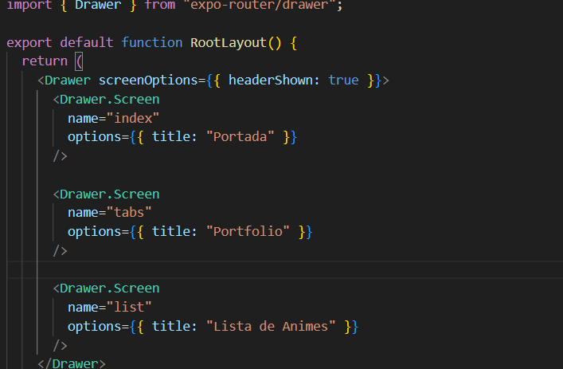
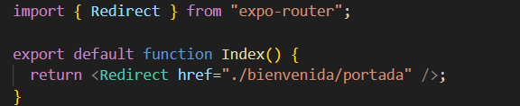

4. Añade un Drawer a la aplicación. Haz que por defecto la pantalla inicial sea la de bienvenida.

# Se creo todas la propiedades adecuadas para la pantalla inicial sea la de bienvenidad

[Volver al Readme](../README.md)