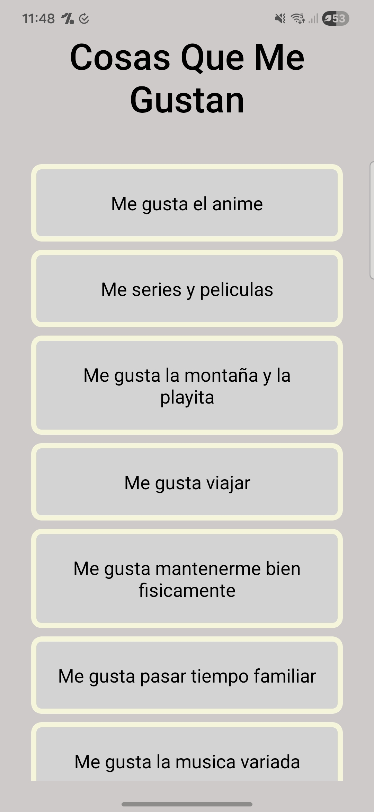
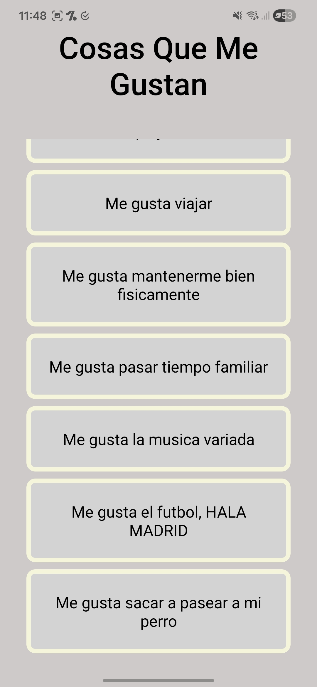
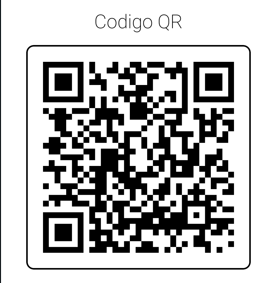
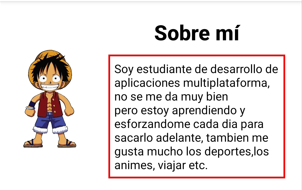
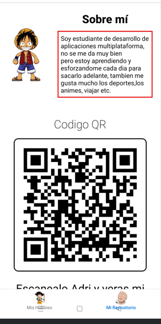

2. Recicla tu portfolio de la actividad de los apuntes de la unidad anterior y tráelo a este proyecto cumpliendo lo siguiente:

# Crea una pantalla para la lista de hobbies.

Se creo la pantalla de los hobbies correctamente.

# Crea una pantalla para el enlace QR del repositorio.

# Crea un componente cabecera del portfolio que tenga la imagen y la descripción personal.

# Utilizando la navegación por ficheros con un layout de Tabs, añade una página portfolio que permita cambiar entre las pantallas de hobbies y la pantalla del código QR. En todo momento debe ser visible la cabecera del portfolio.

# EJEMPLO DE COMO SE VERIA CON LA CABECERA

[Volver al Readme](../README.md)